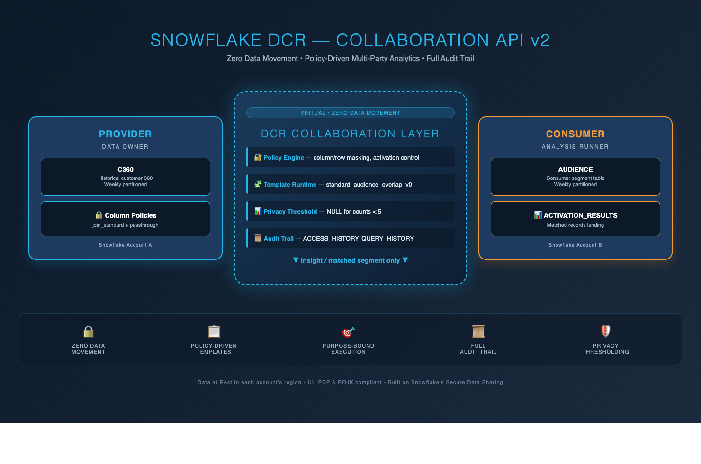
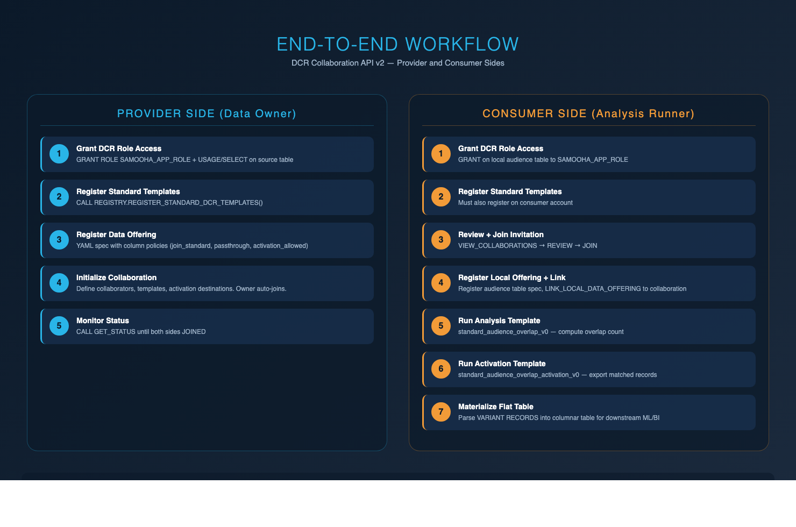
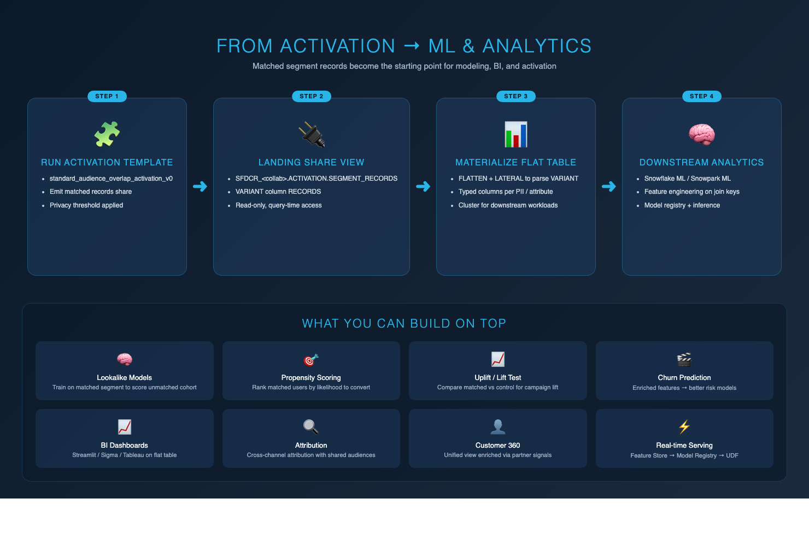
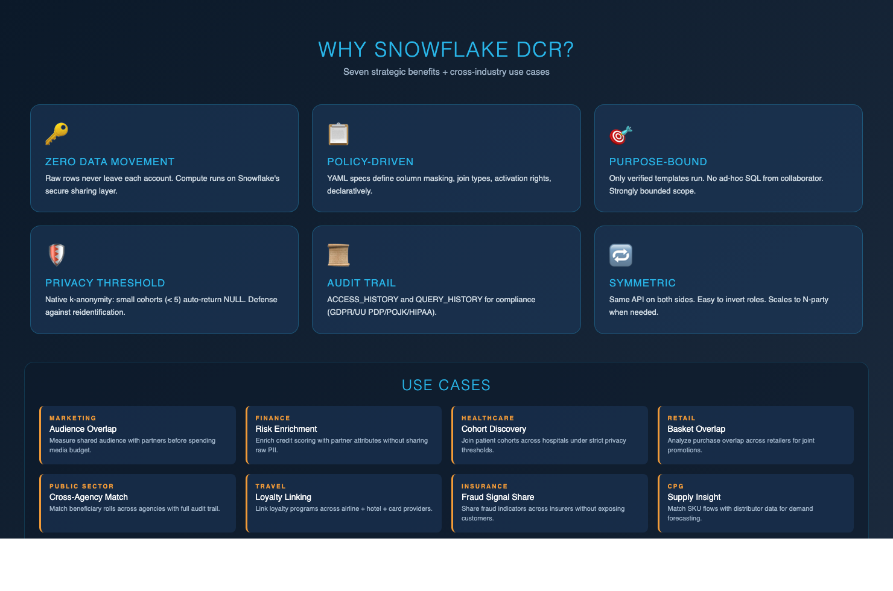

# Building an Audience Overlap Data Clean Room on Snowflake — Collaboration API v2 End-to-End

> A practical walk-through of how two Snowflake accounts can privately overlap and activate audiences — no raw data movement, no manual SQL sharing, and a full audit trail — using Snowflake's Data Clean Room Collaboration API v2.


<!-- Image 1: 01_architecture.png — Reference architecture. Hero image. Place at top of article. -->

---

## 1. What Is a Data Clean Room?

A **Data Clean Room (DCR)** is a privacy-preserving environment where two or more parties can jointly analyze their data **without exposing raw records** to each other. Every party contributes data, every party benefits from insight, and nobody walks away with the other party's PII.

Classical ways of "sharing data" — FTP exports, hashed-file handoffs, trusted third parties — all break at least one of these properties:

- **Data minimization** — only what is needed should be shared.
- **Purpose binding** — data is used only for the declared purpose.
- **Auditability** — every access should be traceable.
- **Regulatory safety** — compliance with GDPR, Indonesia's UU PDP, POJK, HIPAA, and sector-specific rules.

A data clean room is the modern answer. It keeps each party's raw data in place, runs *verified* queries on top of the logical join, and returns only pre-approved outputs. Think of it as a **secure compute overlay** across multiple clouds, regions, or corporate tenants.

---

## 2. How Snowflake Helps With Clean Rooms

Snowflake's **Secure Data Sharing** is the foundation. Instead of copying data, Snowflake exposes live, read-only references across accounts — even across regions and clouds — without egress. On top of that foundation, Snowflake offers:

- **Native Apps & Native DCR (SAMOOHA)** — the platform and templates behind the Collaboration API.
- **Row and Column Access Policies** — field-level privacy enforcement.
- **Privacy Thresholding** — small-cohort results return NULL (k-anonymity by default).
- **Access & Query History** — every call is logged at the platform level.
- **ACCOUNTADMIN-controlled approvals** — no silent shares, no backdoors.

For analysts, the payoff is that the DCR runs **on Snowflake compute**. The same warehouses, clustering keys, partition pruning, and tooling you already use work inside the clean room. No separate stack, no separate bill.

---

## 3. Snowflake DCR via the Collaboration API v2

Historically, Snowflake DCR had an asymmetric model: one party was the *provider* and the other the *consumer*, with different SQL surfaces.

**Collaboration API v2** changes this. It introduces a **symmetric, declarative** model:

- Every participant uses the **same API** (same stored procedures, same YAML spec shape).
- The clean room is defined by a **YAML collaboration spec** — templates, policies, warehouses, activation destinations — all declarative.
- **Standard templates** (e.g. `standard_audience_overlap_v0`, `standard_audience_overlap_activation_v0`) give you best-practice overlap and activation flows out of the box.
- **Purpose-bound execution** — only the templates allow-listed in the spec can run. No ad-hoc SQL from a collaborator.
- **Native to Snowflake** — everything runs on warehouses in each party's own region, with ACCESS_HISTORY and QUERY_HISTORY for full audit.

This is the API we'll use in the rest of this post.


<!-- Image 2: 02_workflow.png — Two-track provider/consumer workflow. Place right before the Workflow section. -->

---

## 4. GitHub Reference

All SQL and Python used in this post — including the YAML specs, the provider and consumer notebooks, and the README — is published here:

**Repo:** [github.com/arzamuhammad/dcr-collaboration-api](https://github.com/arzamuhammad/dcr-collaboration-api)

Key files referenced below:

- `README.md` → [link](https://github.com/arzamuhammad/dcr-collaboration-api/blob/main/README.md)
- `03_provider_notebook/provider_workflow.sql` → [link](https://github.com/arzamuhammad/dcr-collaboration-api/blob/main/03_provider_notebook/provider_workflow.sql)
- `04_consumer_notebook/consumer_workflow.sql` → [link](https://github.com/arzamuhammad/dcr-collaboration-api/blob/main/04_consumer_notebook/consumer_workflow.sql)

---

## 5. Prerequisites

Before starting, each party should have:

1. **Two Snowflake accounts** in the same or different regions — one acting as **provider**, the other as **consumer**. Roles can be swapped freely; the API is symmetric.
2. **`ACCOUNTADMIN`** (or an equivalent role that can install the Native App and grant `SAMOOHA_APP_ROLE`).
3. **The SAMOOHA native app installed** (`SAMOOHA_BY_SNOWFLAKE_LOCAL_DB`) in both accounts.
4. **Source tables ready**:
   - Provider: a customer-360 style table — in this walk-through we call it `C360`.
   - Consumer: a marketing audience table — we call it `AUDIENCE`.
5. **A join key strategy** — usually a hashed PII column (e.g., `HASHED_PHONE_SHA256`) with consistent salting on both sides.
6. **A warehouse** sized for each side's workload.
7. **Column classification decided up front** — which columns are `join_standard` (usable for joins), which are `passthrough` (returnable in activation), which are internal.

---

## 6. Step-by-Step: Provider Workflow

*Full script:* [`provider_workflow.sql`](https://github.com/arzamuhammad/dcr-collaboration-api/blob/main/03_provider_notebook/provider_workflow.sql)

### 6.1 Grant DCR App access to source data

```sql
GRANT USAGE ON DATABASE   <db>     TO APPLICATION ROLE SAMOOHA_APP_ROLE;
GRANT USAGE ON SCHEMA     <schema> TO APPLICATION ROLE SAMOOHA_APP_ROLE;
GRANT SELECT ON TABLE     <schema>.C360 TO APPLICATION ROLE SAMOOHA_APP_ROLE;
```

### 6.2 Register the standard templates

```sql
CALL SAMOOHA_BY_SNOWFLAKE_LOCAL_DB.REGISTRY.REGISTER_STANDARD_DCR_TEMPLATES();
```

### 6.3 Register the data offering

Defined as a YAML spec. Key fields:

```yaml
data_offering:
  name: provider_c360_offering_v1_0
  source_table: <db>.<schema>.C360
  column_policies:
    - name: HASHED_PHONE_SHA256
      category: join_standard
      column_type: EMAIL          # any supported PII type
    - name: DATE_PARTITION
      category: passthrough
    - name: AGE_GROUP
      category: passthrough
      activation_allowed: true
```

Then register:

```sql
CALL SAMOOHA_BY_SNOWFLAKE_LOCAL_DB.PROVIDER.REGISTER_DATA_OFFERING(<yaml_spec>);
```

### 6.4 Initialize the collaboration

```sql
CALL SAMOOHA_BY_SNOWFLAKE_LOCAL_DB.COLLABORATION.INITIALIZE(
  <collaboration_spec_yaml>,
  <warehouse_name>
);
```

The provider (as owner) is auto-joined. The collaboration enters `CREATING → CREATED` while the back-end sets up shares and privileges.

### 6.5 Monitor status

```sql
CALL SAMOOHA_BY_SNOWFLAKE_LOCAL_DB.COLLABORATION.GET_STATUS('<collab_name>');
```

Once both parties are `JOINED`, the room is ready.

> **Note:** Provider-side auto-join can take several minutes on first-time setup — that's background share provisioning work, not your query. Subsequent recurring runs are near-instant.

---

## 7. Step-by-Step: Consumer Workflow

*Full script:* [`consumer_workflow.sql`](https://github.com/arzamuhammad/dcr-collaboration-api/blob/main/04_consumer_notebook/consumer_workflow.sql)

### 7.1 Grant DCR App access to source data

```sql
GRANT USAGE ON DATABASE <db> TO APPLICATION ROLE SAMOOHA_APP_ROLE;
GRANT USAGE ON SCHEMA   <schema> TO APPLICATION ROLE SAMOOHA_APP_ROLE;
GRANT SELECT ON TABLE   <schema>.AUDIENCE TO APPLICATION ROLE SAMOOHA_APP_ROLE;
```

### 7.2 Register standard templates

```sql
CALL SAMOOHA_BY_SNOWFLAKE_LOCAL_DB.REGISTRY.REGISTER_STANDARD_DCR_TEMPLATES();
```

### 7.3 View + review + join the invitation

```sql
CALL SAMOOHA_BY_SNOWFLAKE_LOCAL_DB.COLLABORATION.VIEW_COLLABORATIONS();
CALL SAMOOHA_BY_SNOWFLAKE_LOCAL_DB.COLLABORATION.REVIEW('<collab_name>');
CALL SAMOOHA_BY_SNOWFLAKE_LOCAL_DB.COLLABORATION.JOIN('<collab_name>', '<warehouse>');
```

### 7.4 Register local offering + link it

The consumer also declares its local offering (the audience table) and links it to the collaboration:

```sql
CALL SAMOOHA_BY_SNOWFLAKE_LOCAL_DB.PROVIDER.REGISTER_DATA_OFFERING(<yaml>);
CALL SAMOOHA_BY_SNOWFLAKE_LOCAL_DB.COLLABORATION.LINK_LOCAL_DATA_OFFERING(
  '<collab_name>', '<local_offering_name>'
);
```

### 7.5 Run the analysis template

```sql
CALL SAMOOHA_BY_SNOWFLAKE_LOCAL_DB.COLLABORATION.RUN(
  '<collab_name>',
  'standard_audience_overlap_v0',
  <analysis_spec_yaml>
);
```

Result: a privacy-thresholded overlap count — small cohorts (< 5 rows) return NULL automatically.

### 7.6 Run the activation template

```sql
CALL SAMOOHA_BY_SNOWFLAKE_LOCAL_DB.COLLABORATION.RUN(
  '<collab_name>',
  'standard_audience_overlap_activation_v0',
  <activation_spec_yaml>
);
```

Activation outputs arrive as a read-only share at:

```
SFDCR_<collab_name>.ACTIVATION.SEGMENT_RECORDS
```

…with the matched records encoded in a `RECORDS` VARIANT column.

### 7.7 Materialize a flat table for downstream work

```sql
CREATE OR REPLACE TABLE matched_segment AS
SELECT
  r.value:"c1.HASHED_PHONE_SHA256"::string AS hashed_phone_sha256,
  r.value:"c1.AGE_GROUP"::string           AS age_group,
  r.value:"c1.DATE_PARTITION"::date        AS date_partition
FROM SFDCR_<collab_name>.ACTIVATION.SEGMENT_RECORDS s,
     LATERAL FLATTEN(input => s.RECORDS) r;
```

You now have a typed, columnar landing table ready for feature engineering, BI, or ML.

---

## 8. From Activation → Further Analytics & ML


<!-- Image 4: 04_analytics.png — Activation → Flat Table → ML pipeline. Place at top of section 8. -->

The activation output is not an endpoint — it's the *starting point* for downstream work. Because everything lands in a Snowflake table, every Snowflake analytics and ML capability is available on top of it:

- **Snowpark / Snowflake ML (`snowflake-ml-python`)** — train lookalike, propensity, churn, or uplift models on the matched segment; register them with `Registry.log_model()`; serve via warehouse inference.
- **Cortex Analyst / Cortex Search** — natural-language queries over the flat table for business stakeholders.
- **Streamlit / Sigma / Tableau** — dashboards directly on the flat table.
- **Feature Store** — elevate the engineered features as reusable assets for other downstream models.
- **Downstream activation loops** — the matched segment can become the audience for the next campaign, closing the loop.

Because the activation table lives in the consumer's account, **all downstream work inherits the privacy boundary** set by the clean room — nothing escapes that boundary, and every downstream query is still subject to the consumer's governance.

---

## 9. Benefits and Use Cases


<!-- Image 3: 03_benefits.png — 6-tile benefits grid + 8-tile use case gallery. Place at top of section 9. -->

### Benefits

- **Zero data movement** — raw rows stay in their owner's account.
- **Policy-driven** — YAML specs govern column access, join types, activation rights.
- **Purpose-bound** — only the declared templates can run.
- **Privacy thresholding** — native k-anonymity for small cohorts.
- **Full audit trail** — `ACCESS_HISTORY` + `QUERY_HISTORY` for compliance.
- **Symmetric API** — roles can be inverted; scales to multi-party.
- **Native performance** — Snowflake warehouses, clustering, pruning all apply.
- **GitOps friendly** — YAML specs and SQL can be version-controlled.

### Use Cases

| Industry | Scenario |
|---|---|
| Marketing | Audience overlap and activation with partners before spending media budget |
| Finance | Credit-scoring enrichment across partners without exposing PII |
| Healthcare | Cross-institution cohort matching with privacy thresholds |
| Retail | Joint brand × retailer promotions with closed-loop measurement |
| Public Sector | Cross-agency beneficiary match with audit |
| Insurance | Fraud-signal sharing across carriers |
| Travel | Multi-provider loyalty linking (airline × hotel × card) |
| CPG | Supply insight matched with distributor sell-through data |

---

## Closing Thoughts

The Collaboration API v2 makes Snowflake DCR **declarative, symmetric, and developer-friendly**. If your team has ever wanted to jointly analyze data with a partner but hit a wall of NDAs, hashed-file handoffs, or bespoke integration work, this is the path forward.

The complete reference implementation — including all YAML specs, both notebooks, and the full README — is on GitHub:

**→ [github.com/arzamuhammad/dcr-collaboration-api](https://github.com/arzamuhammad/dcr-collaboration-api)**

If you end up building a DCR with the Collaboration API, I'd love to hear about your patterns — drop a comment or reach out directly.

---

*Written April 2026. Based on Snowflake DCR Collaboration API v2 / `SAMOOHA_BY_SNOWFLAKE_LOCAL_DB`.*
